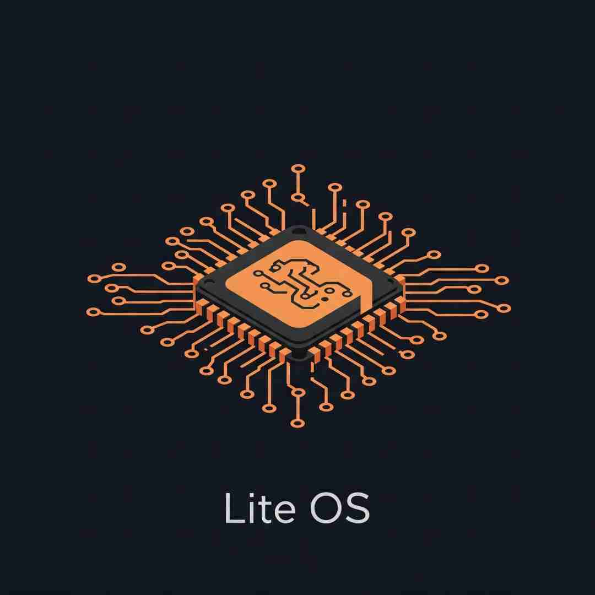

# wavm

## 组名

wavm

## 组徽

## 组员

- [朱东胜 PB23111587](https://github.com/ustc1587)
- [杨博文 PB23111611](https://github.com/OwenYang1102)
- [徐家慧 PB23050897](https://github.com/Clara-X)
- [秦铭格 PB23111594](https://github.com/QinMingge)
- [袁谦朗 PB23111711](https://github.com/csjike)

## 项目进展

| 项目阶段 |      日期      |                           工作内容                           |
| :------: | :------------: | :----------------------------------------------------------: |
|   选题   | 3月2日—3月8日  | 结合往届选题和老师上课提到的选题方向，每个人选择一个感兴趣的方向进行初步调研：秦铭格，徐家慧：AI for OS；杨博文，朱东胜：Rust重构；袁谦朗：使用ray进行大模型分布式部署 |
|   选题   |     3月8日     | 第一次线下讨论。确定了Rust重构选题，具体包括IPFS，Linux模块，微型WebAssembly虚拟机等方向。 |
|   选题   | 3月9日—3月17日 | 对Rust重构的各个方向进入深入调研，分析其价值，可行性和任务量等。 |
|   选题   |    3月17日     | 第二次线下讨论。IPFS的庞大代码库涉及DHT、Bitswap等复杂协议，异步编程复杂，基于Go的实现比较完善，重写任务量大且价值不高；Rust重构Linux目前生态不完善，参考教程少，面对C与Rust的兼容性、内核高度耦合替换难度大、调试困难等问题，风险大；WebAssembly作为一种可移植、高性能的二进制指令格式，已成为边缘计算、区块链、插件系统等领域的核心技术，用 Rust 实现微型WebAssembly虚拟机高度可行且价值显著，尤其在安全敏感和资源受限的场景中。因此，确立选题为微型WebAssembly虚拟机wavm。 |

