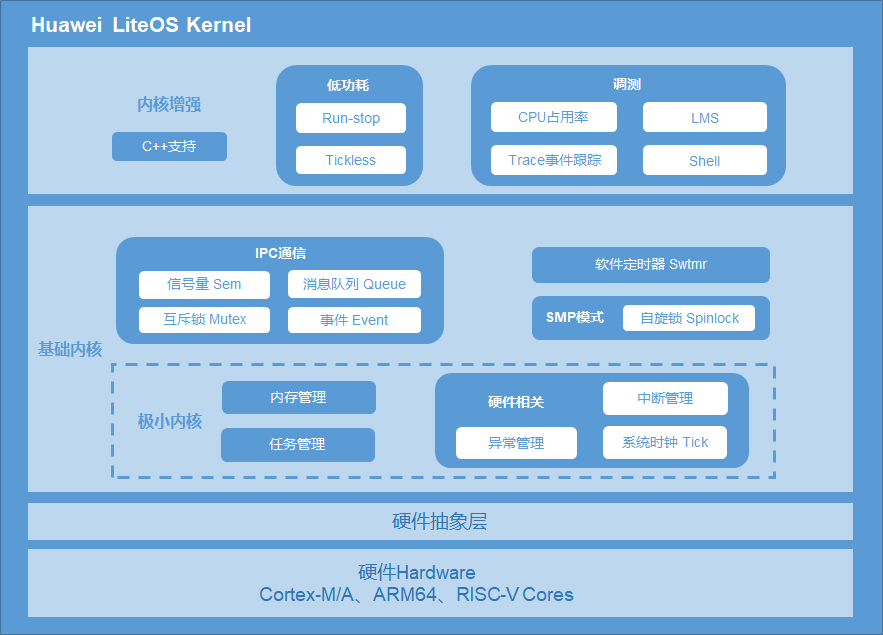
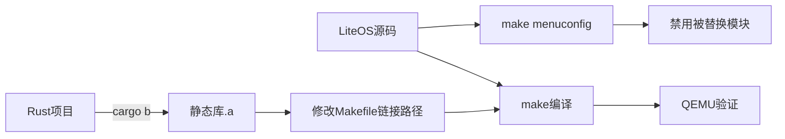
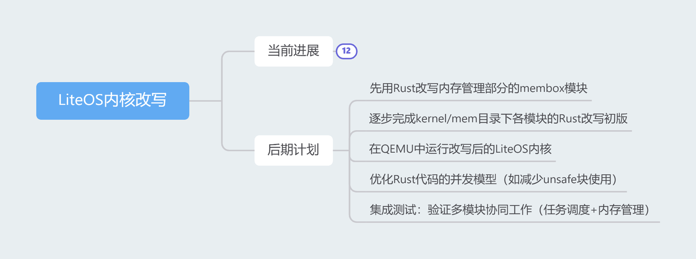
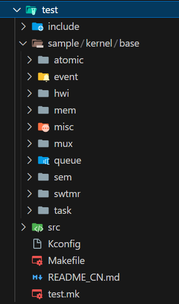
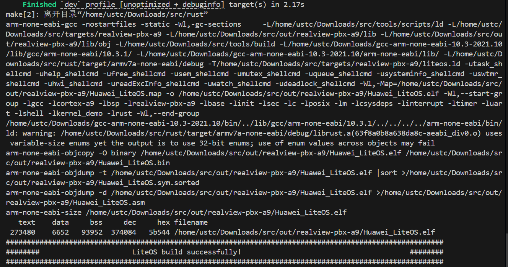
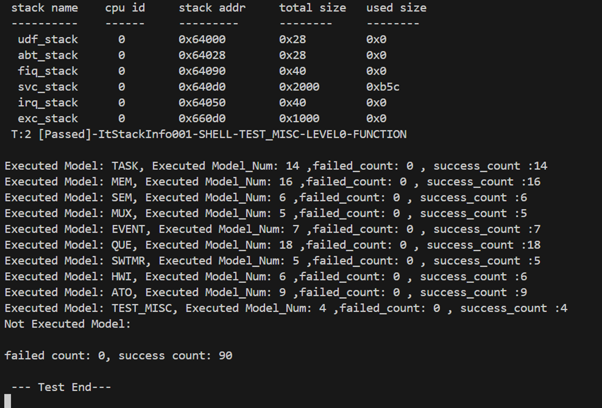
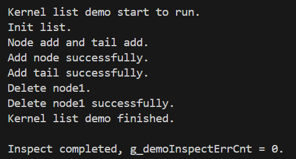

- [项目概述](#项目概述)
  - [项目背景](#项目背景)
  - [C语言的缺陷和Rust的优势](#c语言的缺陷和rust的优势)
  - [项目目标](#项目目标)
  - [LiteOS内核代码框架](#liteos内核代码框架)
    - [1. 调试模块（debug）](#1-调试模块debug)
    - [2. 头文件模块（include）](#2-头文件模块include)
    - [3. 内存管理模块（mem）](#3-内存管理模块mem)
    - [4. 调度模块（sched）](#4-调度模块sched)
    - [5. Shell 命令模块（shellcmd）](#5-shell-命令模块shellcmd)
    - [6. 其他核心文件](#6-其他核心文件)
- [编译经验总结](#编译经验总结)
  - [rust交叉编译](#rust交叉编译)
  - [C和rust混合编译](#c和rust混合编译)
    - [C调用rust](#c调用rust)
    - [rust调用C](#rust调用c)
    - [混合编译流程图](#混合编译流程图)
- [中期计划回顾](#中期计划回顾)
- [重构策略与技术挑战](#重构策略与技术挑战)
  - [如何重构](#如何重构)
    - [模块化组织代码](#模块化组织代码)
    - [Result枚举带来的健壮错误处理](#result枚举带来的健壮错误处理)
    - [零成本抽象](#零成本抽象)
    - [更安全的宏系统](#更安全的宏系统)
    - [所有权与生命周期](#所有权与生命周期)
  - [Unsafe处理](#unsafe处理)
    - [Unsafe场景](#unsafe场景)
    - [FFI统一管理](#ffi统一管理)
      - [问题挑战](#问题挑战)
      - [解决方案](#解决方案)
    - [全局变量](#全局变量)
      - [问题挑战](#问题挑战-1)
      - [解决方案](#解决方案-1)
    - [内存管理](#内存管理)
      - [问题挑战](#问题挑战-2)
      - [解决方案](#解决方案-2)
    - [使用类型系统辅助安全性](#使用类型系统辅助安全性)
      - [问题挑战](#问题挑战-3)
      - [解决方案](#解决方案-3)
    - [数据结构替换](#数据结构替换)
      - [问题挑战](#问题挑战-4)
      - [解决方案](#解决方案-4)
    - [总结](#总结)
  - [测试](#测试)
    - [单元测试](#单元测试)
    - [示例测试](#示例测试)
- [实现结果与测试](#实现结果与测试)
  - [改写代码组织框架](#改写代码组织框架)
    - [模块设计细节](#模块设计细节)
    - [框架设计优势](#框架设计优势)
  - [测试结果](#测试结果)
    - [编译与链接成功](#编译与链接成功)
    - [测试全部通过](#测试全部通过)
    - [Demo运行成功](#demo运行成功)
- [总结与展望](#总结与展望)
  - [工作总结](#工作总结)
    - [已实现的核心模块](#已实现的核心模块)
    - [迁移策略总结](#迁移策略总结)
    - [`unsafe` 代码处理策略](#unsafe-代码处理策略)
  - [未来工作展望](#未来工作展望)
    - [1. 性能深度评估](#1-性能深度评估)
    - [2. 多核与多平台支持](#2-多核与多平台支持)
    - [3. 功能与生态系统扩展](#3-功能与生态系统扩展)

# 项目概述

## 项目背景

​随着物联网设备数量的爆发式增长，轻量级实时操作系统（RTOS）在智能家居、工业自动化等场景中广泛应用。华为LiteOS作为一款高性能的嵌入式操作系统，凭借其低功耗、高实时性和模块化架构，在物联网领域占据重要地位。然而，LiteOS是基于C语言开发的，存在内存安全隐患、并发可靠性不足以及生态扩展性受限等问题。Rust语言主要在安全性、性能、生态支持等方面有巨大优势，用Rust改写C语言操作系统已成趋势。为了提升系统的安全性、可靠性和开发效率，我们计划使用Rust语言对LiteOS内核进行重构。

## C语言的缺陷和Rust的优势

C 语言缺乏自动内存边界检查，依赖开发者手动管理内存，容易出现内存泄漏、缓冲区溢出等问题。Rust 的所有权模型和借用检查机制在编译期就能消除这些内存安全问题。

同时，C 语言在多线程场景下缺乏编译期安全检查，易引发数据竞争或死锁。Rust 的并发模型通过所有权和借用系统确保线程安全，避免数据竞争。C 语言的开发模式难以适应现代软件对安全性和可维护性的需求，且缺乏包管理、泛型支持和单元测试框架，导致大型项目维护成本激增。Rust 的现代化工具链和丰富的生态系统能够提高开发效率，降低维护成本。

## 项目目标

本项目旨在利用 Rust 语言对 LiteOS 内核进行重构，以解决 C 语言的固有缺陷，提升系统的安全性、可靠性和开发效率。Rust 语言以其所有权模型和借用检查机制，在编译期就能消除空指针解引用、缓冲区溢出等内存安全问题，从根本上提升系统的稳定性。同时，Rust 的并发模型通过类型系统强制保证线程安全，避免数据竞争和死锁问题，适用于 LiteOS 的多任务调度场景。

## LiteOS内核代码框架

LiteOS 的内核层代码主要集中在 `kernel/base` 目录下，这一部分是整个操作系统的核心，负责提供基础的操作系统功能。如下将介绍各个模块的相关功能。



### 1. 调试模块（debug）

调试模块提供了内核调试功能，帮助开发者诊断和解决问题。它包含以下文件：

```markdown
- `los_mux_deadlock.c`：实现互斥锁死锁检测功能。
- `los_mux_debug.c`：提供互斥锁的调试功能。
- `los_queue_debug.c`：实现队列操作的调试功能。
- `los_sched_debug.c`：提供调度器的调试功能。
- `los_sem_debug.c`：实现信号量操作的调试功能。
```

### 2. 头文件模块（include）

该模块包含了内核的私有头文件，定义了内核内部使用的数据结构、接口和宏定义。这些头文件主要供内核模块之间使用，确保模块间协同工作的基础。关键文件包括：

```markdown
- `los_binarytree_pri.h`：定义二叉树相关数据结构和操作。
- `los_err_pri.h`：定义内核错误码。
- `los_event_pri.h`：定义事件相关数据结构和接口。
- `los_mem_pri.h`：定义内存管理相关数据结构和接口。
- `los_mux_pri.h`：定义互斥锁相关数据结构和接口。
- `los_queue_pri.h`：定义队列相关数据结构和接口。
- `los_sched_pri.h`：定义调度器相关数据结构和接口。
- `los_sem_pri.h`：定义信号量相关数据结构和接口。
- `los_task_pri.h`：定义任务管理相关数据结构和接口。
```

### 3. 内存管理模块（mem）

内存管理模块负责内存资源的分配和回收，支持多种内存分配算法。它包含以下子模块：

```markdown
- `bestfit`：实现基于最佳匹配算法的内存分配。
  - `los_memory.c`：实现内存分配和释放逻辑。
  - `los_memory_internal.h`：声明内部使用的内存管理接口。
  - `los_multipledlinkhead.c`：实现多链表操作逻辑。
- `bestfit_little`：实现轻量级的最佳匹配内存分配算法。
  - `los_heap.c`：实现堆内存管理逻辑。
  - `los_memory.c`：实现内存分配和释放逻辑。
  - `los_memory_internal.h`：声明内部使用的内存管理接口。
- `common`：公共内存管理逻辑。
  - `memstat`：内存统计功能。
    - `los_memstat.c`：实现内存使用统计功能。
  - `multipool`：多内存池管理。
    - `los_multipool.c`：实现多内存池管理逻辑。
- `membox`：内存块管理。
  - `los_membox.c`：实现内存块的创建和销毁。
  - `los_membox_dyn.c`：实现动态内存块管理逻辑。
- `slab`：Slab 内存分配算法。
  - `los_slab.c`：实现 Slab 分配器的核心逻辑。
  - `los_slabmem.c`：实现 Slab 内存管理逻辑。
```

### 4. 调度模块（sched）

调度模块负责任务调度和管理，支持多种调度算法。它包含以下子模块：

```markdown
- `sched_mq`：基于消息队列的调度算法。
  - `los_sched.c`：实现消息队列调度逻辑。
- `sched_sq`：基于优先级队列的调度算法。
  - `los_priqueue.c`：实现优先级队列逻辑。
  - `los_sched.c`：实现优先级队列调度逻辑。
```

### 5. Shell 命令模块（shellcmd）

Shell 命令模块提供了命令行工具，用于系统运行时的监控和管理。它包含以下文件：

```markdown
- `hwi_shellcmd.c`：实现硬件中断相关的命令。
- `mempt_shellcmd.c`：实现内存分区相关的命令。
- `stack_shellcmd.c`：实现堆栈信息相关的命令。
- `swtmr_shellcmd.c`：实现软件定时器相关的命令。
- `sysinfo_shellcmd.c`：实现系统信息查询命令。
- `task_shellcmd.c`：实现任务管理相关的命令。
```

### 6. 其他核心文件

```markdown
- `Makefile`：定义模块的编译规则和流程。
- `los_bitmap.c`：实现位图操作逻辑。
- `los_err.c`：实现错误码相关功能。
- `los_event.c`：实现事件管理逻辑。
- `los_exc.c`：实现异常处理逻辑。
- `los_hwi.c`：实现硬件中断管理逻辑。
- `los_lockdep.c`：实现锁依赖检测功能。
- `los_misc.c`：实现各种杂项功能。
- `los_mp.c`：实现多核处理器支持逻辑。
- `los_mux.c`：实现互斥锁核心逻辑。
- `los_percpu.c`：实现每核数据管理逻辑。
- `los_printf.c`：实现内核打印功能。
- `los_queue.c`：实现队列管理逻辑。
- `los_ringbuf.c`：实现环形缓冲区逻辑。
- `los_sem.c`：实现信号量核心逻辑。
- `los_sortlink.c`：实现排序链表逻辑。
- `los_stackinfo.c`：实现堆栈信息管理逻辑。
- `los_swtmr.c`：实现软件定时器核心逻辑。
- `los_task.c`：实现任务管理核心逻辑。
- `los_tick.c`：实现系统节拍（Tick）逻辑。
```

# 编译经验总结
基于LiteOS的改写实践，我们总结了一些rust交叉编译与C/Rust混合编译经验，希望能供其他人参考。
## rust交叉编译
rust交叉编译需要进行以下的环境配置：
1. Rust目标安装
```bash
rustup target add armv7a-none-eabi
```

2. C交叉工具链
安装ARM GCC工具链（如 gcc-arm-none-eabi），验证编译器是否安装成功：
```bash
arm-none-eabi-gcc -v
```

3. Cargo配置（.cargo/config.toml）
指定裸机目标：
```toml
[build]
target = "armv7a-none-eabi"     # Cortex-A9
```

## C和rust混合编译
### C调用rust
1. 创建lib项目c_call_rust，同时创建C文件，完成后，项目目录结构如下：
```text
.
├── csrc/
    ├── main.c
└── src/
    ├── lib.rs
└── target/
    ├── .gitignore
    ├── Cargo.lock
    └── Cargo.toml
```
2. 编写lib.rs
```rust
#[unsafe(no_mangle)]
pub fn add(left: i32, right: i32) -> i32 {
    left + right
}
```
- 为了防止函数名被编译器修改，可以加上`#[unsafe(no_mangle)]`。

- 为了能让rust的函数通过FFI被C调用，需要加上`extern "C"`对函数进行修饰。

3. 编写Cargo.toml
```toml
[package]
name = "c_call_rust"
version = "0.1.0"
edition = "2024"

[lib]
name="add"
crate-type = ["staticlib"]
```
其中crate-type = ["staticlib"]指定rustc编译结果是什么类型，默认为rust自用的rlib格式库，为了让C语言调用，需要更改为静态库或者动态库，这里指定为静态库类型。

4. 编译rust项目
```bash
cargo build
```
5. 编写main.c
```c
#include <stdio.h>
#include <stdint.h>

extern int32_t add(int32_t left, int32_t right);

int main()
{
    printf("1 + 1 = %d\n", add(1, 1));
    return 0;
}
```
这里就和写正常C语言代码差不多，唯一需要注意的是声明一下要使用的rust函数。

6. 编译main.c
```bash
gcc -o main main.c -L../target/debug -ladd
```
`-L../target/debug`指定静态库所在的目录，`-ladd`链接名为`libadd.a`的静态库。


7. 运行`main`程序，观察到以下结果
```bash
1 + 1 = 2
```

### rust调用C
不采用中期汇报中的那种编译rust的时候先编译C代码的方式，而是分别编译rust和C代码，最后直接链接在一起。

1. Makefile修改
```makefile
# LiteOS根目录Makefile
# 添加 Rust 静态库路径
LITEOS_LDFLAGS += -L$(LITEOSTOPDIR)/rust_liteos/target/armv7a-none-eabi/debug
LITEOS_BASELIB += -lrust_liteos  # 匹配librust_liteos.a
```

2. 模块替换规范
   
- 注释原C模块：
```makefile
# kernel/base/mem/Makefile
# LOS_SRC := los_err.c  # 注释掉被Rust替换的模块
```

- 通过menuconfig配置所需的模块：

```text
[ ] Run Kernel Dynamic Mem Demo  # 空间键切换选中状态
```
### 混合编译流程图



# 中期计划回顾
在中期汇报时，我们组提出了以下计划：


现在对这些计划进行回顾与总结：
- **Rust改写成果**：我们基本实现了对kernel/base目录下的核心模块（如内存管理、调度、任务管理等）的Rust重构。除了与valist相关的不定长参数函数，由于Rust语言本身尚未提供对C风格可变参数的完整支持，这部分代码的改写工作受到限制。

- **优化处理unsafe**：我们识别并总结了四类unsafe块处理方法，在消息队列模块中成功实践了unsafe优化，为后续模块改写提供了技术方案参考。但由于时间限制，未能推广到其他模块。

- **测试与验证**：通过QEMU模拟器进行系统级验证，我们成功运行了liteos自带的test程序，初步验证了改写代码的正确性。但性能和鲁棒性还有待进一步的测试。

总体而言，项目在核心功能改写方面取得了显著进展，为操作系统内核的Rust化积累了宝贵经验。

# 重构策略与技术挑战

## 如何重构

### 模块化组织代码

**C 语言的挑战：** C 语言主要依赖文件包含（`#include`）预处理指令来组织代码，这种机制容易导致全局命名空间污染，因为所有的宏、函数和全局变量都可能在 `#include` 后暴露。模块的边界因此变得模糊不清，缺乏强制性的封装，使得依赖关系难以追踪和管理，尤其在大型项目中，命名冲突和意外副作用屡见不鲜。

**Rust 的改进：** Rust 提供了一个强大且富有表现力的**模块系统**。通过 `mod` 关键字，我们可以将代码逻辑地组织成一个清晰的树状层级结构，每个文件或目录天然地形成一个模块。例如，在我们的项目中，内核的核心功能被清晰地划分到 `task`、`mutex`、`queue`、`interrupt` 等独立的目录中，每个目录都对应一个独立的 Rust 模块。

利用 `pub` 关键字精确控制可见性，我们能够严格限定哪些项对外暴露，强制实现了模块间的封装。同时，`use` 关键字使得我们可以精确地导入所需的功能，避免了全局命名冲突，并使得代码的依赖关系一目了然。这种层次分明、依赖明确的结构极大地提高了代码的可读性、可维护性和协作效率。

### Result枚举带来的健壮错误处理

**C 语言的挑战：** C 函数通常通过返回特殊的整数值（如 `-1` 或自定义的错误码）来表示错误，而真正的结果则通过指针参数传递。这种错误处理方式既繁琐又容易出错，因为调用者很容易忘记检查返回值，或者错误地解释错误码，从而导致未定义行为或程序崩溃。同时，C 语言缺乏统一的错误报告机制，错误信息往往不明确。

**Rust 的改进：** Rust 推荐使用 **`Result<T, E>` 枚举**来处理可能失败的操作。`Result` 枚举有两个变体：`Ok(T)` 表示操作成功并返回结果 `T`；`Err(E)` 表示操作失败并返回错误信息 `E`。

在我们的重构中，我们定义了统一的返回类型 `SystemResult<T>`，它实际上是 `Result<T, SystemError>` 的别名。同时，我们为每个内核模块（如 `Task`、`Mutex`、`Queue`）定义了具体的错误类型枚举（例如 `TaskError`、`MutexError`），这些具体的错误类型最终聚合到顶层的 `SystemError` 枚举中。这种设计强制调用者必须通过 **`match` 表达式**或 **`?` 操作符**来显式地处理所有可能发生的错误，使得错误处理变得强制且类型安全，极大地增强了系统的健壮性和可靠性。

### 零成本抽象

Rust 允许我们构建高级的、富有表达力的抽象，而不会在运行时引入额外的性能开销。这对于性能敏感的内核开发至关重要。

- **方法实现：** 我们使用 **`impl` 关键字**为结构体（`struct`）实现方法，例如为 `QueueControlBlock` 实现 `is_empty()`、`is_full()` 等。这使得代码更符合面向对象的直觉，提高了代码的可读性和内聚性。由于 Rust 的静态分发和积极的**编译器内联优化**，这些方法在编译后大多会直接展开，性能与直接访问结构体成员并进行计算的性能几乎相同，不存在额外的运行时开销。
- **类型安全的标志位与状态：** 我们用 **`enum`** 来替代 C 语言中的 “魔术数字”，例如用 `TaskStatus` 枚举清晰地表示任务的各种状态（如 `Ready`, `Running`, `Blocked`）。这不仅提高了代码的可读性，也利用类型系统防止了无效状态的赋值。对于需要进行位运算的标志位（flags），我们使用 **`bitflags` crate**。`bitflags!` 宏在编译时展开为高效的位操作，提供了类型安全的、类似枚举的位掩码定义方式，比 C 语言中手动的位级别操作（`|`, `&`, `~`）更安全、更清晰，且**在运行时没有额外开销**。
- **零成本封装：** **`#[repr(transparent)]`** 属性允许我们创建一个围绕另一个类型的**零成本封装器**。这意味着一个被 `#[repr(transparent)]` 标记的结构体或枚举，其内存布局将与其唯一的非零大小字段完全相同。在编译后的机器码中，这个封装器类型不会引入任何额外的内存开销或运行时开销。它本质上只是一个编译器层面的类型别名，提供了更强的类型安全、更好的可读性和更丰富的行为（通过 `impl` 块添加方法），但在内存中与被封装的类型完全等价。这在为现有底层类型添加业务逻辑或类型约束时尤其有用，例如为 `u32` 封装一个 `QueueId`。

### 更安全的宏系统

**C 语言的挑战：** C 语言的预处理器宏是简单的文本替换，它不理解代码的语法结构。这极易导致问题。

**Rust 的改进：** Rust 提供了强大的宏系统，包括**声明式宏**（`macro_rules!`）。声明式宏是“卫生宏”（Hygienic Macros），它们在语法树层面进行操作，而不是原始文本层面。这意味着宏内部定义的变量不会与调用方的变量发生意外冲突，大大提高了宏的安全性和可预测性。我们使用宏来定义了 `print_info!`、`print_error!` 等日志宏，它们在使用上既方便又安全，同时继承了 Rust 编译器的所有安全检查。

### 所有权与生命周期

这是 Rust 最核心的特性，也是我们重构工作能够获得巨大安全收益的根本原因。

**C 语言的挑战：** 在 C 语言中，所有资源的生命周期（包括内存、文件句柄、锁等）完全由程序员手动负责，编译器无法提供任何帮助。这导致悬垂指针（访问已释放的内存）、内存泄漏（忘记释放内存）和二次释放等成为 C 代码中最常见且最危险的错误来源。在并发环境中，C 语言更难防范数据竞争，因为没有编译器层面的强制保证。

**Rust 的改进：** Rust 的**所有权系统**在编译时强制执行一套严格的规则：

- 唯一所有者：每个值有且只有一个所有者。

- 自动释放：当所有者变量离开作用域时，其所拥有的值（及其占用的资源）会被自动丢弃（`drop`），从而从根本上杜绝了内存泄漏和二次释放问题。

- 借用：

  数据可以通过“借用”的方式被临时访问，而无需转移所有权。借用分为：

  - **不可变借用（`&T`）：** 可以有多个，允许多个读者同时访问数据。
  - **可变借用（`&mut T`）：** 只能有一个，确保独占写入权限。

- 生命周期：编译器通过**生命周期分析**来确保所有引用（借用）的有效性不会超过其所指向的数据。

这个机制在**编译时**就静态地检查并确保了以下关键安全属性：

- **无数据竞争：** 编译器会强制检查，确保不会同时存在多个可变借用，或同时存在可变与不可变借用，这从根本上防止了多进程环境下的数据竞争。
- **无悬垂指针：** 编译器确保任何引用都不会指向已被释放或无效的内存。

## Unsafe处理

尽管 Rust 以其编译时内存安全而闻名，但在操作系统内核开发这类底层领域，某些操作本质上是“不安全”的，例如与硬件直接交互、调用外部 C 函数（FFI），或进行原始内存操作。在 LiteOS 重构项目中，我们的核心策略不是完全消除 `unsafe` 代码，而是将其**严格控制在最小范围内，并将其封装到提供安全接口的抽象层中**。这确保了内核代码的大部分能够享受到 Rust 的安全保证，同时满足底层系统编程的必需。

### Unsafe场景

在重构过程中，我们遇到以下几类不可避免需要 `unsafe` 的场景：

1. **解引用裸指针：** C 语言的核心就是指针操作。在 Rust 中，我们使用**裸指针**（`*const T` 和 `*mut T`）来模拟 C 指针的直接内存访问能力。这在解析特定内存区域时是必需的。所有裸指针的解引用都必须发生在 `unsafe` 块中。
2. **使用 `union`：** C 语言中的 `union` 类型允许在同一内存空间中存储不同类型的数据。Rust 也提供了 `union` 类型，但访问其字段需要 `unsafe`，因为编译器无法在编译时确定当前哪个字段是活跃的，可能读到无效数据。
3. **调用外部 C 函数与导出 Rust 函数：** 当需要与现有 LiteOS C 代码库进行互操作时，**外部函数接口（FFI）**是桥梁。
   - 调用 C 函数时，Rust 需要 `unsafe extern "C"` 块来声明外部函数。
   - 同样，为了让 C 代码能调用 Rust 函数，Rust 函数也需要使用 `#[no_mangle]` 或 `#[export_name]` 属性来指定符号名称，而这些属性在新版本的 Rust 中也要求 `unsafe` 。
4. **实现某些底层数据结构：** 在构建高性能或资源受限的数据结构时，例如**内存分配器**或**侵入式链表**，有时需要直接操作内存并绕过 Rust 的所有权和借用规则。这些实现需要仔细编写和审查，并封装在安全的 API 之后。
5. **内存模型操作：** `core::ptr` 和 `core::mem` 模块中提供的一些底层函数，如 `core::ptr::read`、`core::ptr::write`、`core::mem::transmute` 等，用于直接对内存进行读写或类型转换。这些操作直接作用于内存的原始字节，绕过 Rust 的类型系统检查，因此必须是 `unsafe` 的。

### FFI统一管理

#### 问题挑战

- Rust 与 C 互操作时，所有外部函数声明（`extern "C"`）和导出函数都涉及 `unsafe`，因为编译器无法验证跨语言调用的安全。
- C 代码常用裸指针传递数据，Rust 需要手动校验指针有效性和解引用。
- `#[no_mangle]` 和 `#[export_name]` 属性要求 `unsafe`。

#### 解决方案

我们通过构建一个**独立的 FFI 模块**来集中管理所有外部函数声明和 Rust 导出函数：

- **集中式管理：** 所有与 C 交互的代码都集中在 `ffi` 模块内（例如，`ffi/bindings` 模块包含 C 函数的声明，`ffi/exports` 模块包含导出给 C 的 Rust 函数）。这种统一管理使得 `unsafe` 边界清晰可见，便于审查和维护。
- **前置安全校验：** 在所有导出的 Rust FFI 函数中，我们优先进行**前置的安全校验**，特别是针对传入的裸指针参数。例如，我们会先检查指针是否为 `null`。只有在确认了指针的有效性后，才会进入 `unsafe` 块进行解引用操作，以尽可能确保安全。
- **渐进式移除：** 随着重构进度的推进，当某个 C 模块完全被 Rust 代码替代后，其对应的 FFI 绑定和导出函数就可以从 `ffi` 模块中移除，逐步减少 `unsafe` 代码的体量。

例如：

```rust
/// 获取队列信息的FFI导出函数
#[unsafe(export_name = "LOS_QueueInfoGet")]
pub extern "C" fn los_queue_info_get(queue_id: u32, queue_info: *mut QueueInfo) -> u32 {
    // 检查队列信息指针是否为空
    if queue_info.is_null() {
        return QueueError::PtrNull.into();
    }
    let queue_info = unsafe { &mut *queue_info };
    // 调用内部实现获取队列信息
    match get_queue_info(queue_id.into(), queue_info) {
        Ok(_) => OK,
        Err(e) => e.into(),
    }
}
```

### 全局变量

#### 问题挑战

在内核开发中，全局变量的使用是不可避免的。Rust 对全局可变静态变量 (`static mut`) 的访问要求 `unsafe`。为了提升安全性，我们采用了以下两种策略提升安全性：

#### 解决方案

1. 简单全局变量

对于计数器、标志位等简单的全局变量，我们优先使用 Rust 标准库中的**原子类型**（如 `AtomicU32`、`AtomicBool`、`AtomicPtr` 等）替代 `static mut`。

- **无锁并发：** 原子类型提供了原子的、无锁的读写和修改操作（如 `load`, `store`, `fetch_add`），能在多线程和中断环境下保证数据一致性和安全性，无需进入临界区或额外加锁。
- **编译时安全：** 原子类型的操作本身是安全的 Rust 函数，不需要 `unsafe` 块。

例如：

```rust
pub static IRQ_NESTING_COUNTS: AtomicU32 = AtomicU32::new(0);

/// 获取当前CPU的中断嵌套计数
pub fn irq_nesting_count_get() -> u32 {
    IRQ_NESTING_COUNTS.load(Ordering::Acquire)
}

/// 设置当前CPU的中断嵌套计数
pub fn irq_nesting_count_set(val: u32) {
    IRQ_NESTING_COUNTS.store(val, Ordering::Release);
}

/// 增加当前CPU的中断嵌套计数
pub fn irq_nesting_count_inc() {
    IRQ_NESTING_COUNTS.fetch_add(1, Ordering::AcqRel);
}

/// 减少当前CPU的中断嵌套计数
pub fn irq_nesting_count_dec() {
    IRQ_NESTING_COUNTS.fetch_sub(1, Ordering::AcqRel);
}

```

2. 复杂全局变量

对于结构体、链表等复杂或需要多步操作才能保证一致性的全局状态，我们通过 `critical-section` crate 提供的 `Mutex` 进行保护。

- **临界区保护：** `critical-section` crate 提供了一个可移植的机制来定义临界区。在单核嵌入式系统（如 LiteOS）中，其底层实现通常是通过**屏蔽中断**来确保进入临界区后，当前 CPU 不会被中断处理程序打断，从而保证了对共享全局变量的独占访问。
- **`Mutex<T>` 和 `RefCell<T>`：** 我们使用 `Mutex<RefCell<T>>` 的组合。`Mutex` 提供跨线程的互斥访问，而 `RefCell` 提供了运行时借用检查，允许在 Rust 的不可变引用中进行内部可变性。当获取 `Mutex` 锁后，在临界区内访问 `RefCell` 是安全的。

```rust
pub static QUEUE_POOL: Mutex<RefCell<[QueueControlBlock; QUEUE_LIMIT as usize]>> = Mutex::new(
    RefCell::new([QueueControlBlock::UNINIT; QUEUE_LIMIT as usize]),
);

pub static UNUSED_QUEUE_LIST: Mutex<RefCell<LinkedList<usize>>> =
    Mutex::new(RefCell::new(LinkedList::new()));

pub fn init_queue_system() {
    with(|cs| {
        let mut queue_pool = QUEUE_POOL.borrow_ref_mut(cs);
        let mut unused_list = UNUSED_QUEUE_LIST.borrow_ref_mut(cs);
        queue_pool
            .iter_mut()
            .enumerate()
            .for_each(|(index, queue)| {
                queue.set_id(QueueId(index as u32));
                unused_list.push_back(index);
            });
    })
}
```

通过这两种方式，我们将全局变量的操作安全，提升了内核的安全性和健壮性。

### 内存管理

#### 问题挑战

C 语言的内存管理依赖于裸指针和 `union` 等，是内存泄漏、悬垂指针和二次释放等问题的常见根源。

- Rust 的 `alloc` crate 提供了更安全的堆内存分配方式，但 `dealloc` 需要显式传递分配时的 size，和 C 的 `free` 不兼容。

#### 解决方案

`alloc` crate 是 Rust 库的一部分，它提供了堆内存分配的抽象。它允许你在运行时动态地分配和释放内存，而无需手动管理原始指针，从而极大地提升了内存安全性。

`alloc` crate 本身并不是一个具体的内存分配器实现（如 `malloc` 的背后实现），而是一个**内存分配器接口的抽象**。它定义了 `GlobalAlloc` 这个 trait。任何实现了这个 trait 的类型都可以被注册为全局内存分配器，为 Rust 程序提供堆内存。

当你使用 `Box<T>`, `Vec<T>`, `String`, `HashMap` 等 Rust 标准库中涉及堆分配的类型时，它们默认会通过 `alloc` crate 提供的全局分配器来获取和释放内存。

`alloc` crate 提供的核心接口包括：

- **`alloc(layout: Layout) -> *mut u8`**: 根据指定的内存布局（大小和对齐要求）分配一块原始内存，并返回一个裸指针。如果分配失败，则返回空指针。
- **`dealloc(ptr: *mut u8, layout: Layout)`**: 释放之前通过 `alloc` 分配的内存。**它要求你提供分配时的原始指针和相同的内存布局**。

LiteOS 这样的 C 语言操作系统通常使用 `malloc` 和 `free` 进行内存管理。这两者的接口与 `alloc` crate 存在一个关键差异：

- **C 语言的 `free(void* ptr)`**: 只接受一个指向待释放内存的指针。它期望内存分配器内部能够追踪到该指针对应的分配大小和对齐信息。
- **Rust `GlobalAlloc` trait 的 `dealloc(&self, ptr: *mut u8, layout: Layout)`**: 除了指针 `ptr`，还**明确要求提供原始分配时的 `Layout` 信息（包含 `size` 和 `align`）**。

这种接口不一致是重构过程中的一大挑战。如果直接修改所有 C 代码中的 `free` 调用，为它们添加 `size` 参数，那将是一个巨大的工作量，且极易引入新的错误。

一种解决方案是修改C中的 `free` 函数，为其添加 `size` 和 `align` 信息，这种开销很小，但是工作量大且容易出错。

我们目前采用另一种解决方案是：在每次通过 `alloc` crate 进行内存分配时，**额外分配一小段空间，用于记录本次分配的有效大小和对齐要求**。

```rust
#[repr(C)]
struct MemHeader {
    size: usize,  // 用户请求的内存大小 (不包含 Header 本身)
    align: usize, // 用户请求的对齐边界
}
```

1. **分配流程改造：** 当 LiteOS 中的某个模块需要分配 `N` 字节的内存时，Rust 的内存管理模块会执行以下步骤：
   - 计算实际需要分配的字节数：`N + size_of::<MemHeader>()`。
   - 通过 `alloc::alloc` 分配内存。
   - 将本次分配信息写入到分配内存的起始位置。
   - 将指向实际数据区域的指针返回给调用者。
2. **释放流程改造：** 当 LiteOS 中的某个模块需要释放一个指针 `P` 指向的内存时，Rust 的内存管理模块会执行以下步骤：
   - 获取原始分配的起始指针：`P - size_of::<MemHeader>()`。
   - 从原始分配的起始指针处读取之前记录的分配信息。
   - 调用 `alloc::dealloc` 来释放内存。

权衡：

- 优点：无需大规模修改现有 C 代码中的 `free` 调用，工作量小，迁移过程更平滑。
- 缺点：引入了少量额外的内存开销。

### 使用类型系统辅助安全性

Rust 强大的类型系统是其安全性的基石。在重构过程中，我们积极利用 Rust 的安全抽象来替代 C 代码中常见的裸指针和不安全的内存结构。

#### 问题挑战

- **C 代码中裸指针的泛滥：** C 代码大量依赖裸指针来管理数据结构和内存，这容易导致悬垂指针、野指针和内存泄漏。
- **Rust 类型与 C 布局不兼容：** Rust 的高级抽象（如 `Box`、`Vec`）在内存布局上与 C 的简单指针和数组可能不兼容，这限制了直接替换。

#### 解决方案

在 Rust 代码内部，我们优先使用安全类型（如`Box<T>`、`Vec<T>`、`Option<T>`、`RefCell<T>`）来替代裸指针和原始数组。例如，在队列模块中，我们用 `Option<Box<[u8]>>` 替代指针来管理队列的内部内存缓冲区。

```rust
pub struct QueueControlBlock {
    queue_mem: Option<Box<[u8]>>,
    // ...其他字段...
}
```

  - `Box<[u8]>` 提供了堆上分配的、所有权明确的字节切片，确保在所有权转移时内存被安全管理。
  - `Option<T>` 则优雅地处理了内存可能未分配或已释放的情况，避免了空指针错误。

然而，这种替换会带来另一种问题，`QueueControlBlock` 结构体的内存布局不在和C中的结构体一致。为此，在重构后期，我们适当调整了 C 代码，使其通过 FFI 调用 Rust 函数来操作这些封装在 Rust 内部的结构体，从而实现了这些结构体的私有性和内部实现细节的隐藏，降低了耦合。

### 数据结构替换

#### 问题挑战

C 语言内核中广泛使用的**侵入式链表**虽然高效，因为它将链表节点直接嵌入数据结构中，避免了额外的内存分配，但其 API 涉及大量裸指针操作，极易引入错误。

#### 解决方案

在重构过程中，我们**逐步用 Rust 提供的安全、非侵入式数据结构替代原有的侵入式链表**。比如：

- **`VecDeque<T>`：** 对于需要高效双端插入/删除操作的队列场景（例如管理空闲的对象池索引），我们优先使用 `VecDeque`。它提供了良好的性能和内存局部性。
- **`LinkedList<T>`：** 对于需要频繁在中间进行插入/删除（且能获得迭代器）或对内存连续性要求不高的场景，我们使用 `LinkedList`。

尽管这种替换可能带来**一定程度的内存开销**（每个节点需要额外的指针存储）以及在特定场景下有**轻微的性能损失**，但相比之下，其在**安全性和可维护性上的巨大提升**是压倒性的。它使得数据结构操作变得类型安全、可读性更强，并消除了大量 `unsafe` 代码。

### 总结

通过上述多方面的措施，我们系统地处理了 Rust 重构 LiteOS 过程中不可避免的 `unsafe` 代码。我们将 `unsafe` 的使用严格控制在最小范围，并将其封装在提供安全接口的抽象层中。所有不安全操作都集中管理、严格审查，并逐步用 Rust 的类型系统、标准库数据结构和并发原语提供的**安全抽象**进行替换。最终目标是让内核的主体业务逻辑代码尽量不含 `unsafe`，只在必要的**边界层**（如 FFI 绑定、底层内存分配器）使用，从而显著提升了 LiteOS 内核的整体安全性和健壮性。

## 测试

### 单元测试

`LiteOS/test` 目录提供了一个专门用于对内核各个模块进行细粒度测试的框架，这个框架负责定义测试用例、执行测试、断言（Assert）以及报告测试结果。

```
test/
├── Kconfig
├── Makefile
├── README.md
├── include
│   ├── icunit.h
│   ├── los_test_pri.h
│   ├── ostest.h
│   └── test_common.h
├── sample
│   └── kernel
│       └── base
│           ├── atomic
│           ├── event
│           ├── hwi
│           ├── misc
│           ├── mux
│           ├── queue
│           ├── sem
│           ├── swtmr
│           └── task
├── src
│   ├── icunit.c
│   ├── ostest.c
│   └── test_common.c
└── test.mk
```

这一层测试的目的是验证内核**内部模块**的正确性。它关注单个函数或一个模块内部的逻辑是否符合预期，覆盖各种边界条件和异常情况，确保底层功能的稳定可靠。



### 示例测试

`LiteOS/demo` 目录提供了一系列示例应用程序。

例如，一个 `demo` 包括以下操作：

1. 创建一个高优先级的任务A和一个低优先级的任务B（任务模块）
2. 任务A和任务B通过一个消息队列进行通信（消息队列模块）
3. 它们共享一个临界资源，并使用互斥锁来保护访问（互斥锁模块）

这一层测试的目的是验证内核**不同模块之间协同工作**的正确性，通过运行这些 demo，我们可以从应用开发者的视角来检验内核的整体功能是否稳定、可用。

# 实现结果与测试

## 改写代码组织框架

为了将LiteOS逐步改写为Rust语言，我们建立了清晰的Rust模块化架构：

```
rust/src/
├── event          # 事件管理
├── ffi/           # C-Rust互操作
│   ├── bindings   # C语言绑定
│   └── exports    # 导出到C的接口
├── interrupt      # 中断管理
├── memory         # 内存管理
├── mutex          # 互斥锁
├── percpu         # 每CPU数据
├── queue          # 队列管理
├── semaphore      # 信号量
├── shellcmd       # Shell命令
├── stack          # 栈管理
├── task/          # 任务管理
│   ├── manager    # 任务管理器
│   └── sync       # 同步原语
├── tick           # 系统滴答
├── timer          # 定时器
└── utils          # 工具函数
```

### 模块设计细节

在各个模块中，我们一般按照约定好的方式组织代码。以Semaphore模块为例：

```
rust/src/semaphore
├── core.rs		# 信号量核心操作实现
├── error.rs		# 错误类型与错误码定义
├── global.rs		# 全局资源管理
├── mod.rs		# 模块声明与公共接口
└── types.rs		# 类型定义与数据结构
```

### 框架设计优势

1. 采用模块化的方式组织代码，把每个功能域独立成模块，既有利于我们划分任务，又便于我们统一代码组织方式，更好地进行交互与整合代码。

2. 在`ffi/exports`中统一管理所有FFI边界，建立安全抽象层。保持与C代码的ABI兼容性，便于渐进式改写内核。

## 测试结果

### 编译与链接成功



### 测试全部通过



从图中结果可知，90 条测试样例全部通过。

### Demo运行成功

各个模块的demo均运行成功，错误个数`g_demoInspectErrCnt`为0。



# 总结与展望

## 工作总结

我们成功完成了 **LiteOS 内核基础模块从 C 到 Rust 的重构**，并支持在搭载单核 `cortex_a_r` 处理器的 `realview PBX-A9` 开发板上运行。通过 `Qemu` 模拟器进行了模块单元测试和整体 demo 测试，充分验证了功能正确性。

### 已实现的核心模块

具体实现的模块包括：

* **错误处理 (error)**：统一的错误类型定义与处理机制。
* **事件管理 (event)**：系统事件的创建、等待与通知机制。
* **异常处理 (exception)**：硬件与软件异常的捕获与处理。
* **外部函数接口 (ffi)**：C 语言互操作的安全封装层。
* **中断管理 (interrupt)**：中断控制器的初始化与中断处理。
* **内存管理 (mem)**：动态内存分配与释放的安全实现。
* **互斥锁 (mutex)**：线程间同步的互斥访问控制。
* **每 CPU 数据 (percpu)**：CPU 本地数据的管理与访问。
* **消息队列 (queue)**：进程间通信的消息传递机制。
* **信号量 (semaphore)**：资源计数与同步控制。
* **栈管理 (stack)**：任务栈的分配、保护与回收。
* **软件定时器 (swtmr)**：可编程的软件定时功能。
* **任务管理 (task)**：任务的创建、调度与生命周期管理。
* **系统时钟 (tick)**：系统节拍与时间管理。
* **工具函数 (utils)**：通用的辅助功能与工具集。

### 迁移策略总结

C 和 Rust 在语言特性与设计理念上存在显著差异，因此我们采用了以下策略来完成从 C 到 Rust 的迁移：

* **模块化管理**：C 语言通过头文件进行代码包含，而 Rust 利用 **`mod` 模块系统和 `pub/use` 关键字** 实现更清晰的模块划分与依赖管理。
* **错误处理机制**：C 语言依赖易被忽视的错误码，而 Rust 采用 **`Result<T, E>` 枚举**，强制开发者处理成功或失败 (`Ok(T)/Err(E)`)。结合统一错误类型与 `match/?` 操作符，实现了强制且类型安全的错误处理。
* **功能函数重构**：C 语言是面向过程的，迁移到 Rust 时，我们通过 **`impl` 为结构体添加方法**，并利用 `#[repr(transparent)]` 创建无内存/运行时开销的封装器，实现了零成本抽象。
* **宏的替代**：C 宏是简单的文本替换，而 Rust 的声明式宏是**“卫生宏”**，更安全、可预测，在功能和性能上能完全替代 C 宏。

### `unsafe` 代码处理策略

从 C 到 Rust 迁移的核心工作是 `unsafe` 代码的处理。我们的策略是：**严格限制 `unsafe` 范围，并将其封装在安全接口中。**

* **`Unsafe` 场景**：仅在模拟 C 指针操作、访问 `union` 字段、进行跨语言 FFI 交互、实现底层数据结构或直接操作内存模型时使用 `unsafe`。
* **FFI 统一管理**：所有 C 语言交互代码集中于独立的 **FFI 模块**。其导出的 Rust FFI 函数会先进行安全校验再进入 `unsafe` 块，并随重构进展逐步移除。
* **全局变量处理**：简单全局变量使用 Rust 的**原子类型**进行无锁并发操作；复杂全局变量则通过 `Mutex<RefCell<T>>` 和临界区保护独占访问。
* **内存管理兼容**：为兼容 C 的 `free` 接口，Rust 内存分配会在头部额外记录大小和对齐信息。这降低了重构工作量，但略微增加了内存开销。
* **类型系统辅助安全**：Rust 代码内部优先使用 `Box<T>`、`Vec<T>` 等**安全类型**替代 C 裸指针，并通过 FFI 调用 Rust 函数操作封装结构体，以提升私有性和解耦。
* **数据结构替换**：逐步用 **Rust 安全、非侵入式数据结构**（如 `VecDeque<T>`、`LinkedList<T>`）替代 C 侵入式链表，以显著提升安全性和可维护性。

这些策略最大限度地减少了 `unsafe` 代码的使用，并对必要的 `unsafe` 块进行了严格审查，从而显著提升了 LiteOS 内核的整体安全性和健壮性。

## 未来工作展望

本次 Rust 化重构显著提升了 LiteOS 的安全性与代码质量。然而，受限于当前项目的时间与资源，仍有诸多领域有待探索与完善。

### 1. 性能深度评估

* **当前不足**：本次重构未能进行详细的性能测试，部分 Rust 化改写所带来的实际性能影响目前仅停留在推测层面。
* **未来展望**：未来的工作应**聚焦于对 Rust 化 LiteOS 进行全面的基准性能测试**。这包括对关键路径、调度延迟、内存访问模式等进行深入分析，识别潜在的性能瓶颈。通过量化数据驱动的优化，我们将能够更精准地提升系统的实时性和整体运行效率，确保其在性能敏感的嵌入式场景下依然具备竞争力。

### 2. 多核与多平台支持

* **当前不足**：本次重构主要集中在单核架构下的基础内核功能验证，尚未能扩展到多核环境下的复杂并发控制和资源同步机制。
* **未来展望**：我们期望将 LiteOS 的 Rust 化**延伸至多平台、多核架构**。这将涉及重新设计和实现适用于多核环境的锁、原子操作、任务调度和中断处理机制，以确保高效且无死锁的并发执行。同时，增强硬件适配程度和平台可移植性，使 LiteOS 能够运行在更广泛的嵌入式硬件上，从而解锁更复杂的应用场景和系统设计。

### 3. 功能与生态系统扩展

* **当前不足**：本次重构主要聚焦于基础内核功能的实现与验证，对于 LiteOS 中内核增强部分（如 C++ 支持、高级调测工具）以及部分现有扩展功能（如文件系统、网络协议栈等），我们未能涉及。
* **未来展望**：下一步将**逐步实现内核增强模块的 Rust 化**，例如集成 Rust 原生的错误处理机制到调测框架中，并探索对 C++ ABI (应用程序二进制接口) 的安全兼容性。更长远的计划是**逐步将其他高级功能模块和组件进行 Rust 化**，如文件系统、网络堆栈、设备驱动等，以构建一个特性更丰富、生态系统更完善、应用场景更广泛的现代化嵌入式操作系统，充分发挥 Rust 在安全性、并发性和可靠性方面的优势。