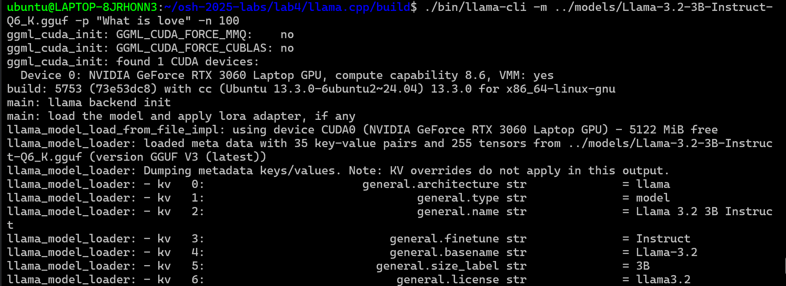
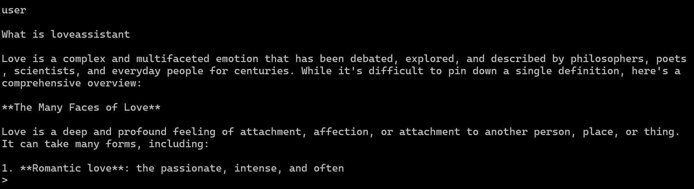
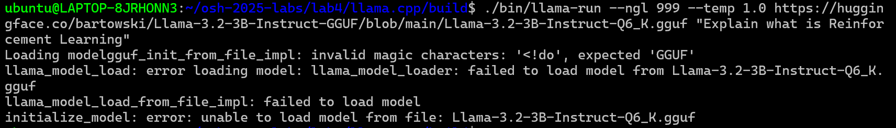
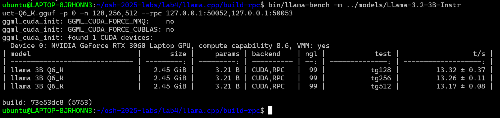

# llama.cpp 部署 LLM 说明文档

- [llama.cpp 部署 LLM 说明文档](#llamacpp-部署-llm-说明文档)
  - [部署过程](#部署过程)
    - [1. llama.cpp 下载编译](#1-llamacpp-下载编译)
    - [2. 大模型下载](#2-大模型下载)
    - [3. 运行模型](#3-运行模型)
  - [性能测试](#性能测试)
  - [性能优化](#性能优化)
  - [RPC 分布式部署](#rpc-分布式部署)


> 本次实验在 WSL-Ubuntu 上完成，GPU 型号为 NVIDIA GeForce RTX 3060

## 部署过程

### 1. llama.cpp 下载编译

首先根据文档在本地克隆 llama.cpp 源码仓库：

```bash
git clone https://github.com/ggml-org/llama.cpp
cd llama.cpp
```

初次编译时产生 cmake 报错信息，因为无法找到 CURL 库，使用如下命令进行安装：

```bash
sudo apt update
sudo apt install libcurl4-openssl-dev
```

此时即可进行 CPU 编译：

```bash
cmake -B build
cmake --build build --config Release -j 8
```

---

还可以通过以下命令下载 [CUDA toolkit](https://developer.nvidia.com/cuda-toolkit)（如果实验环境与我们不同，可以到 nvidia 官网根据配置选择下载方式或命令）：

```bash
wget https://developer.download.nvidia.com/compute/cuda/repos/wsl-ubuntu/x86_64/cuda-keyring_1.1-1_all.deb
sudo dpkg -i cuda-keyring_1.1-1_all.deb
sudo apt-get update
sudo apt-get -y install cuda-toolkit-12-9
```

之后添加选项 `-DGGML_CUDA=ON` 进行 GPU 加速编译：

```bash
cmake -B build -DGGML_CUDA=ON
cmake --build build --config Release
```

### 2. 大模型下载

llama.cpp 支持的模型列表可以在仓库 README.md 文档中找到，本次实验我们决定部署 3B 的 Llama-3.2 模型。

llama.cpp 要求模型只能以 .gguf 文件格式存储，虽然 llama.cpp 提供了相应的格式转换脚本，但为了简便，我们选择从 [hugging face](https://huggingface.co/bartowski/Llama-3.2-3B-Instruct-GGUF/tree/main) 网站上直接手动下载相应的.gguf 文件到 models 文件夹。

### 3. 运行模型

我们可以通过以下命令使用 llama-cli 工具运行模型，与部署的 Llama 模型进行交互：

```bash
./llama-cli -m ./models/llama-7b.gguf -p "What is love?" -n 100
```

`-m` 指定要运行的模型；`-p` 指定输入的 prompt；`-n` 指定一次交互生成的 token 数

运行命令后会产生这样的输出：



输出中可以看到：

```bash
ggml_cuda_init: found 1 CUDA devices:
  Device 0: NVIDIA GeForce RTX 3060 Laptop GPU, compute capability 8.6, VMM: yes
## ...... 大量输出
llama_context:      CUDA0 compute buffer size =   564.73 MiB
llama_context:  CUDA_Host compute buffer size =    14.01 MiB
```

表明使用到了 GPU 计算资源，系统分配给 GPU 的计算缓冲区大小为 564.73 MiB。

经过一长串信息输出，我们最终停留在这样的界面：



每当模型输出完成，会出现 `>` 提示符，我们可以继续输入想要与模型进行的对话，完成后按下回车键即可。

在这里我们可以看到模型的输出被截断了，这是因为我们在之前增加了 `-n 100` 参数，将生成的 token 数截断在了 100，如果希望每次对话内容都能完整生成，可以将 `-n` 设置为 `-1`。

除此之外，我们还可以使用 llama-run 和 llama-service 运行模型，具体命令需要查询原仓库，我们尝试多次均以失败告终，可能是加载模型出了问题。




## 性能测试

接下来我们使用 llama-bench 工具对部署的大模型进行性能测试。

选择的测试指标包括：**生成速度**、**首 token 返回延迟**。具体测试命令请参考 [测试与分析分档](./test_analysis.md)


## 性能优化

在性能测试部分，我们通过对比不同批处理规模、不同线程数以及下放给 GPU 加速执行的不同模型层数，对生成速度以及首 token 生成延迟的影响，可以得出可能的性能优化方案。具体分析参考 [测试与分析分档](./test_analysis.md)


## RPC 分布式部署

为了不同物理电脑的 WSL 之间连接比较困难，超出我们的能力范围，我们决定在同一台物理电脑上的 CPU 和 GPU 上进行分布式部署。

首先启用 `-GGML_RPC=ON` 进行编译:

```bash
cmake .. -DGGML_RPC=ON -DGGML_CUDA=ON
cmake --build . --config Release
```

然后启动两个不同的 `rpc-server` 进程，一个使用 CPU，一个使用 GPU，即在不同的命令行窗口中进入 build/bin 文件夹，并执行以下命令，确保两个服务器实例监听不同的端口：

```bash
./rpc-server -p 50052 # 另一个可以使用50053
```

接下来在主机命令行中启动 `llama-cli`：

```bash
./llama-cli -m ../../models/Llama-3.2-3B-Instruct-Q6_K.gguf -p "What is love?" -n -1 --rpc 127.0.0.1:50052,127.0.0.1:50053
```

然后即可仿照之前的命令对生成速度和首 token 生成延迟进行测试：



之后可将测试数据与单机版部署进行对比。
